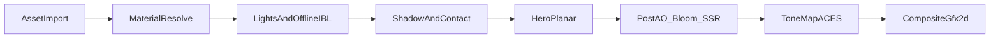

# Realistic PBR Pipeline (canonical)

**Status:** Documentation only. Implementation is **blocked** until this doc is operator-approved.

**Locked decisions (operator):**

| Lock | Choice |
|---|---|
| Reflection strategy | **1C — full stack:** enriched offline IBL + hero planar surfaces + **optional SSR on High tier only** |
| Docs home | **One companion** — this file — plus a Phase stub in [`PLAN.md`](../PLAN.md) (Phase **5.13**; 5.9 was already used for Asset System) |
| HDRI / network env downloads | **Forbidden** (Phase 0 / offlineulate studio offline rule) |

**Stack:** Tauri + React + R3F / three.js. Shared pure mapping in [`src/components/set3d/SetNodes.tsx`](../src/components/set3d/SetNodes.tsx) for editor and Program/Preview.

Principles (lightweight-virtual-studio skill): bake/static where possible; planar only on hero surfaces; SSR only as a High-tier screen-space boost, never the primary reflection strategy; modest-machine budgets; **no ray-tracing promise**.

---

## 1. Purpose & non-goals

### Purpose

Define one drift-resistant path from today's baseline (`meshStandardMaterial` + low-res Lightformer IBL + optional contact/real shadows) to a broadcast-usable PBR look that:

- Runs on the **small-machine contract** (defaults stay cheap; expensive options opt-in / High-tier gated).
- Is **document-driven**: every new field is mirrored `types.ts` → `schema.ts` → `factory.ts` → inspector.
- Stays **offline**: environments and maps live on disk via sidecar `/assets`; no CDN HDRI presets.
- Preserves **parity**: lighting/materials that matter on Program live in `SetNodes.tsx`, shared with the editor.

### Non-goals

| Forbidden / deferred | Why |
|---|---|
| Unreal / Unity / path tracer | Project is R3F/three |
| HDRI downloads or drei `Environment` presets that fetch | Offline failure modes are real here |
| Hardware RT / RTGI / ray-traced mirrors | Not the min-hardware story |
| SSR as the default reflection for all materials / Low–Med | Strategy **1C** = IBL + planar first; SSR is High-only garnish |
| Rec.709 LUT as default color path | Deferred; ACES → sRGB stays |
| OBS / Spout 3D program out | Still Phase 7 in PLAN |

---

## 2. Current baseline (honest inventory)

Do not "upgrade" this section without re-reading the cited files.

### Materials

| Fact | Source |
|---|---|
| `MaterialProps`: `color`, `metalness`, `roughness`, optional `emissive`, `emissiveIntensity`, `opacity` | [`types.ts`](../src/document/types.ts) |
| Defaults: `#8899aa`, metalness `0.3`, roughness `0.5` | `defaultMaterial` in [`factory.ts`](../src/document/factory.ts) |
| Schema mirrors the same fields | `materialSchema` in [`schema.ts`](../src/document/schema.ts) |
| Primitives → **`meshStandardMaterial` only** | `PrimitiveView` in `SetNodes.tsx` |
| Plane + `textureAssetId` → **`meshBasicMaterial`** (PBR bypass — **known gap**) | `ImagePlaneMaterial` |
| Models: loaded as-is; **no** MaterialProps override; **no** forced cast/receive shadows | `ModelView` |
| No `MeshPhysicalMaterial`; no map fields | types + PrimitiveView |

### Environment / render

| Fact | Source |
|---|---|
| `SetEnvironment`: `background`, `floor{enabled,color,metalness,roughness,size}`, `grid`, `ambient`, optional `fog`, optional `backplate` | `types.ts` |
| Floor = large Standard plane, `receiveShadow` | `SetEnvironmentView` |
| `SetRenderSettings`: `exposure`, `shadows`, `dpr`, `bloom`, `vignette`, optional `contactShadows`, `ao`, `envLight` | `types.ts` |
| Defaults: exposure `1.2`, shadows **false**, dpr `1`, bloom/vignette off, contactShadows **on**, ao **off**, envLight **on** @ `0.35` | `defaultSetRenderSettings` |
| IBL: `<Environment resolution={64}>` + **3 hardcoded Lightformers** | `SetEnvironmentView` |
| ContactShadows (drei); real shadows = Canvas + `PCFSoftShadowMap` when on | `SetEnvironmentView` / `RenderSettingsApplier` |
| Spot shadow maps **1024×1024** when casting | `LightView` |
| Color: `ACESFilmicToneMapping` + `SRGBColorSpace` + exposure | `Set3dRenderer.tsx` |
| Video / text / basic image planes: `toneMapped={false}` | `SetNodes.tsx` |

### Architecture invariants

- Pure `SetNodes.tsx` mapping shared by `Set3dEditor` and `Set3dRenderer`.
- Document path: types → schema → factory → UI (`SetInspector.tsx`).
- Small-machine defaults; no forced expensive stack.
- Offline / no CDN env presets.

---

## 3. Target architecture (strategy 1C)

Reflection layers (priority order — implement and reason in this order):

```text
1. Offline IBL (Lightformers and/or local cubemap)     — all tiers
2. Hero planar reflections (floor, optional desk)      — Med+ / High
3. Optional SSR                                          — High only, opt-in
```

IBL carries most materials. Planar sells the studio floor/desk the camera always sees. SSR fills gaps between IBL and planar on shiny non-planar surfaces when the machine can pay for it — it must **never** replace (1) or (2).

### 3.1 Materials

1. Keep **Standard** as the default for authorable primitives.
2. Add a **Physical subset** only when needed — primarily **clearcoat** for lacquered desks. No transmission / IOR / sheen / iridescence in v1.
3. PROPOSED maps: baseColor, normal, packed **ORM** (R=AO, G=Roughness, B=Metalness) or separate maps — all local `Asset` ids via `/assets`.
4. PROPOSED `envMapIntensity` per material.
5. Migrate textured planes from `meshBasicMaterial` → Standard/Physical with image as `map` (known gap today).

#### Authoring ranges (studio)

| Surface | metalness | roughness | Notes |
|---|---:|---:|---|
| Matte paint / fabric | 0.0 | 0.65–0.95 | Avoid pure white albedo |
| Desk laminate | 0.0–0.05 | 0.25–0.45 | Clearcoat for lacquer |
| Brushed metal | 0.8–1.0 | 0.35–0.55 | Needs IBL |
| Chrome / polished | 0.9–1.0 | 0.05–0.2 | Hero only; IBL + nearby planar |
| Soft plastic (factory gray) | 0.0 | 0.4–0.7 | Default `#8899aa` zone |

Do not use metalness ≈ 1 with saturated chromatic albedo.

#### Standard vs Physical

| Condition | Use |
|---|---|
| Color / metalness / roughness / emissive / opacity only | Standard (today) |
| Clearcoat / lacquer desk | Physical subset |
| Transmission / IOR / sheen | Out of scope v1 |

### 3.2 Enriched offline IBL

- Stay offline. No `preset=` / remote HDRI.
- Policy (implementation may pick A then B after profiling):
  - **A.** Raise Lightformer bake `resolution` per tier (today hardcoded `64`).
  - **B.** Optional operator-imported cubemap / EXR stored via sidecar `/assets`.
- Reference Lightformer layout (do not silently rewrite without document support):

| Panel | Color | Intensity | Position | Role |
|---|---|---:|---|---|
| Top | `#ffffff` | 2 | `[0, 5, 0]` | Ceiling fill |
| Left | `#8fb8ff` | 1 | `[-5, 2, 0]` | Cool window |
| Right | `#ffd9a0` | 1 | `[5, 2, 0]` | Warm bounce |

Global strength: `render.envLight.intensity` (default `0.35`). Ambient (`SetEnvironment.ambient`) stays separate — IBL does not replace key/fill/rim nodes.

### 3.3 Hero planar reflections

- Floor first (`SetEnvironment.floor` + PROPOSED `floor.reflector`).
- Optional desk top second — **High tier only**, `maxCount === 2`.
- Technique: drei `MeshReflectorMaterial` (or equivalent planar reflect). **Not** a substitute for SSR; **not** ray tracing.
- Default max: **1** reflector. Never unbounded.
- Budget RT resolution by tier; contact shadows (`y ≈ 0.01`) must not z-fight the reflector (bias/offset at implement time).
- Grid may be suppressed on air when reflector is engaged (product choice — document in UI when built).

### 3.4 Optional SSR (High tier only)

- Mount **only** when `qualityTier === "high"` **and** a PROPOSED `ssr.enabled` (or equivalent) is on.
- Library path: `@react-three/postprocessing` SSR pass inside existing `SetPostEffects` / `EffectComposer` pattern in [`Set3dRenderer.tsx`](../src/components/set3d/Set3dRenderer.tsx) — same "composer mounts only when needed" discipline as Bloom/AO.
- SSR supplements IBL on curved/non-planar gloss; planar hero surfaces still use the planar path (do not expect SSR to replace a floor mirror).
- Low / Medium: SSR code path **must not mount**.
- Defaults: SSR **off** even on High until operator enables it — High unlocks the knob, it does not force the cost.
- Forbidden: SSR as the only reflection system; SSR on Low/Med; promising mirror-perfect SSR.

### 3.5 Lighting & shadows

- Keep document `LightNode`s (`spot` / `point` / `directional`) + motivated 3-point (`studioSets.ts` / `lightingPresets.ts`).
- Area lights: approximate with wide soft spots + Lightformers — **no** full `RectAreaLight` path in v1.
- Prefer **one** primary shadowed key; fill/rim unshadowed.
- ContactShadows default on; real shadow maps opt-in (`render.shadows`, today false).

| Tier | Shadow map size | Guidance |
|---|---:|---|
| Low | 512 if forced | Prefer contact-only |
| Medium | 1024 | Matches today's spot size |
| High | 1024–2048 | Cap; only if frame budget allows |

### 3.6 Color management

- Unchanged: ACES → sRGB + `toneMappingExposure`.
- Video / text / confidence / (today) basic image planes stay `toneMapped={false}`.
- Rec.709 LUT delivery deferred.

---

## 4. Pipeline stages



- **Post block:** N8AO / Bloom / Vignette as today; **SSR only on High when enabled**, inside the same EffectComposer gate.
- Program path: `DocumentRenderer` → `Set3dRenderer` (`RenderSettingsApplier` + `SetEnvironmentView` + `SetNodesView` + `SetPostEffects`) under gfx2d.
- Editor shares node/environment views; gizmos must not contribute light to Program.

---

## 5. Document-model changes (PROPOSED — not implemented)

Every field requires `types` + `schema` + `factory` (+ UI if editable) in the **same** change. All optional for back-compat.

### `MaterialProps`

| Field | Intent |
|---|---|
| `clearcoat?`, `clearcoatRoughness?` | Physical clearcoat |
| `mapAssetId?`, `normalMapAssetId?`, `ormMapAssetId?` (or separate roughness/metalness/ao ids) | Local maps |
| `envMapIntensity?` | Per-material IBL |
| `usePhysical?: boolean` | Explicit Physical opt-in |

### `SetEnvironment.floor`

| Field | Intent |
|---|---|
| `reflector?: { enabled; resolution?; mixStrength?; ... }` | Hero floor planar |

Desk reflector: tagged primitive / PROPOSED `deskReflector` — High only.

### `SetRenderSettings`

| Field | Intent |
|---|---|
| `qualityTier?: "low" \| "medium" \| "high"` | Applies tier table |
| `planarReflection?: { enabled; maxCount?: 1 \| 2 }` | Gate planar |
| `envResolution?: number` | Lightformer bake size (today `64`) |
| `envCubemapAssetId?: string` | Optional local cubemap |
| `ssr?: { enabled: boolean; ... }` | High-only screen-space reflections |

Existing knobs remain. Tiers suggest budgets; they do not delete inspector overrides.

---

## 6. Quality tiers

Frame budgets (lightweight-virtual-studio performance-budgets):

| Output | Total frame | Renderer budget |
|---|---:|---:|
| 1080p30 | 33.33 ms | 24–26 ms |
| 1080p60 | 16.67 ms | 11–13 ms |

Validate 95th/99th percentile; keep ~20% headroom on min machine. **Default posture: Low / Medium.**

| Knob | Low | Medium | High | Factory today |
|---|---|---|---|---|
| `dpr` | 1 | 1 | 1–1.5 (cap 2 if measured) | `1` |
| Real shadows | off | optional (1 key) | on (budgeted) | **false** |
| Shadow map | 512 if on | 1024 | 1024–2048 | Spot 1024 |
| Contact shadows | on | on | on / off if real enough | **on** |
| `envLight` | on @ ~0.35 | on | on | **on @ 0.35** |
| Env bake res | **64** | **128** | **256** | Hardcoded **64** |
| Planar | **off** | floor only (max 1) | floor + optional desk (max 2) | none |
| Planar RT | — | ≤ 512–1024 | ≤ 1024–2048 | — |
| **SSR** | **forbidden** | **forbidden** | **optional opt-in** | none |
| AO (N8AO) | off | rare | optional | **off** |
| Bloom / vignette | off | optional | optional | **off** |
| Materials | Standard | + optional clearcoat | Physical + maps | Standard |

### Feature gates

| Feature | Low | Med | High |
|---|---|---|---|
| Offline Lightformer IBL | yes | yes | yes |
| Raised env resolution | — | yes | yes |
| Floor planar | — | yes | yes |
| Desk planar | — | — | yes |
| SSR | no | no | yes (opt-in) |
| Real shadow maps | discouraged | opt-in | available |

---

## 7. File ownership (implementers may touch)

| Area | Files |
|---|---|
| Document model | `src/document/types.ts`, `schema.ts`, `factory.ts`, `store.ts` (merge helpers only if needed) |
| Shared 3D mapping | `src/components/set3d/SetNodes.tsx` |
| Canvas / post | `Set3dRenderer.tsx`, `Set3dEditor.tsx` (SSR/EffectComposer) |
| Assets | `assetImport.ts` (cubemap / map kinds if added) |
| UI | `SetInspector.tsx`, `LightingPanel.tsx` |
| Presets | `src/sets/studioSets.ts`, `lightingPresets.ts` |
| Verify | `scripts/verify-phase5.ts` or new `verify-realism.ts` |

Do not fork lighting editor vs Program. Do not add network HDRI helpers.

---

## 8. Phased implementation order

Code starts only after operator approval of **this** file.

| Phase | Work | Acceptance (written first) |
|---|---|---|
| **D0** | Docs approved (this file + PLAN stub) | Sign-off in PLAN; no runtime change |
| **D1** | Schema + types + factory for PROPOSED fields (`.optional()`) | Old projects parse; `tsc` clean |
| **D2** | Materials: Standard + optional Physical clearcoat; map wiring | Editor + Program show same look; cold boot |
| **D3** | IBL enrich (`envResolution` / local cubemap) | Sharper metal; **zero** HDRI network fetches |
| **D4** | Planar floor reflector | Hero floor mirror; Med budget holds; max 1 |
| **D5** | Model cast/receive shadows + optional override policy | Key shadows imported desk; no magenta regressions |
| **D6** | Quality tiers UI + gates | Low mounts no planar/SSR; Med planar; High unlocks SSR knob |
| **D7** | High-tier SSR opt-in in `SetPostEffects` | SSR mounts only High+enabled; Low/Med path absent |
| **D8** | Verify + cold-boot soak on min machine | 95th/99th vs tier table |

Project convention: checklists / verify assertions **before** coding each sub-phase; cold launch, not only HMR.

---

## 9. Anti-drift rules

1. **Forbidden:** HDRI CDN/presets; RTGI / hardware RT; SSR on Low/Med; SSR as primary reflection; unbounded planars; inventing `RectAreaLight` as default.
2. **Schema discipline:** no new env/material/render fields without types + schema + factory (+ UI) together.
3. **Shared mapping:** `SetNodes.tsx` owns scene lighting/materials/env for Program and editor.
4. **Confidence monitors:** same lit card; nested confidence stays depth-capped standby (`types.ts`); no second lighter Look.
5. **Video/text:** stay `toneMapped={false}` unless a later color-pipeline phase revisits with scopes.
6. **Defaults stay cheap:** do not default-on real shadows, AO, dual planar, or SSR.
7. **Tier ≠ delete knobs:** tiers set recommended budgets; advanced overrides remain.
8. **SSR order:** IBL + planar first in any PR series; SSR PRs that land without those gates are rejected.

---

## 10. Out of scope / deferred

| Item | Notes |
|---|---|
| HDRI CDN / drei remote presets | Forbidden |
| Ray-traced reflections | Forbidden |
| Full `RectAreaLight` | Soft spots + Lightformers for now |
| Rec.709 / broadcast LUT | After ACES→sRGB period |
| OBS / Spout 3D | Phase 7 |
| Lightmap bake for whole sets | Future |
| Rewriting gfx2d under PBR | Separate pipeline |

---

## 11. How to use this doc

- **Operators:** approve or edit **this file** before any D1+ code. Supporting files under `docs/` that predated the single-companion lock are superseded by this document.
- **Implementers:** contradictions between a PR and this file are defects; update this doc in the same PR if the operator changes a lock.
- **Reviewers:** reject PRs that download environments, enable SSR below High, or add fields only in renderer code without schema.
